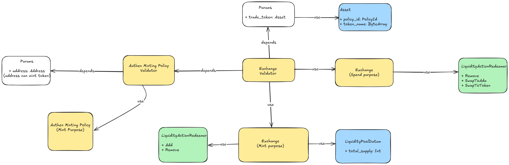

# The Simple DEX

## 1. Overview

- The Simple DEX uses Constant Product Formula (x * y = k). This formula, most simply expressed as x * y = k, states that trades must not change the product (k) of a pair’s reserve balances (x and y). Because k remains unchanged from the reference frame of a trade, it is often referred to as the invariant. This formula has the desirable property that larger trades (relative to reserves) execute at exponentially worse rates than smaller ones.
- This system is provided for trade between one token to ADA token and vice versa. Also, it allows users to deposit/withdraw liquidity to/from the Pool Liquidity UTxO.
- Dua EUTxO model in Cardano. The Pool Liquidity UTxO is created by the Admin, it is unique and has one 
  Authen token. The LP 
  token is minted by the Exchange Contract.

## 2. Architecture

There're 2 contracts in the The Simple DEX system:

- Authen Minting Policy: is responsible for creating Authen Token, which is used to verify the correctness of the 
  Pool Liquidity UTxO
- Exchange Contract: is responsible for trading between 2 tokens. It uses the Constant Product Formula (x * y = k) 
  to calculate the amount of token to be exchanged. The Exchange Contract is also responsible for add and 
  remove assets from the Pool Liquidity UTxO.

Flow of the system:
- Admin mints Authen Token by the Authen Minting Policy. 
- Admin sends Authen Token to the Exchange Contract to create the Pool Liquidity UTxO. 
- After the Pool Liquidity UTxO is created, user can use Pool Liquidity UTxO to:
    - Add liquidity to the Pool Liquidity UTxO and mint LP token.
    - Remove liquidity from the Pool Liquidity UTxO and burn LP token.

## 3. Specification

### 3.1 Actors
- User: An entity who wants to interact with Liquidity Pool to deposit/withdraw liquidity or swap.
- Admin: The actor who can mint Authen Token to create the Pool Liquidity UTxO.

### 3.2 Tokens
- Authen Token: A token used to verify the correctness of the Pool Liquidity UTxO.
- Liquidity Pool token: Represents Liquidity Provider's share of pool, minted by Exchange Contract. Each pool has a different LP token.

### 3.3 Contracts

#### 3.3.1 Authen Minting Policy
Responsible for creating Authen Token, which is used to verify the correctness of the 
  Pool Liquidity UTxO
- Parameter: 
  - `address`: Admin's public key hash
- Datum: None
- Redeemer: None
- Validation:
  + Mint Authen Token if the address input UTxO is Admin's public key hash in the parameter.

#### 3.3.2 Exchange Contract
Responsible for trading between 2 tokens. It uses the Constant Product Formula (x * y = k) 
  to calculate the amount of token to be exchanged. The Exchange Contract is also responsible for creating, add and 
  remove assets from the Pool Liquidity UTxO.

- Parameter: 
  + `trade_token`: policy ID and token name.
  + `authen_token`: policy ID and token name.
- Datum: 
  + `total_supply`: total supply of the Liquidity Pool token.
- Redeemer:
  + `Add`: add liquidity to the Pool Liquidity UTxO and mint LP token.
  + `Remove`: remove liquidity from the Pool Liquidity UTxO and burn LP token.
- Validation:
  + Add:
    * Check if the input UTxO is the same as the Pool Liquidity UTxO.
    * Calculate the amount of token to be added to the Pool Liquidity UTxO
    * Validate the ration between the trade token and ADA in inputs need to equal the ration of Liquidity Pool.
    * Mint LP token to the user by the ration of added Token and reserve token in LP.
  + Remove:
    * Check if the input UTxO is the same as the Pool Liquidity UTxO.
    * Calculate the amount of token to be removed to the Pool Liquidity UTxO
    * Validate the ration between the burned LP token and the total supply of LP token equals the ration of the removed token and the reserve token in LP.
    * Burn LP token from the user.

### 3.4 Transactions

#### 3.4.1 Mint Authen Token
Admin mints Authen Token to create the Pool Liquidity UTxO.
Transaction structure:
- Inputs:
    + Admin's UTxO:
- Mint:
    + Redemeer: None
    + Token name: "Authen Token"
    + Value: 1
- Outputs:
    + Admin's UTxO:
    + Value: 
      + 1 Authen Token

#### 3.4.2 Add Liquidity
User adds liquidity to the Pool Liquidity UTxO.
Transaction structure:
- Inputs:
    + User's UTxO:
      + Datum: None
      + Value: 
        + `x` trade token
        + `y` ADA
    + Pool Liquidity UTxO:
      + Datum:
        + total_supply: `C`
      + Value: 
        + `X` trade token
        + `Y` ADA

- Mint:
    + Redemeer: `Add`
    + Token name: LP token
    + Value: 
        + `min(x/X, y/Y) * C` LP token

- Outputs:
    + User's UTxO:
      + Value:
          + `min(x/X, y/Y) * C` LP token
    + Pool Liquidity UTxO:
      + Value: 
          + `X + x` trade token
          + `Y + y` ADA
      + Datum:
          + total_supply: `C + min(x/X, y/Y) * C`
    